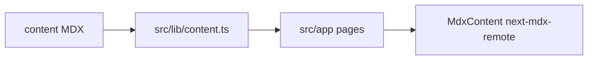

# Architecture

Documents what exists today and what is explicitly planned. Inferred items are marked.

## System overview

Single Next.js 16 App Router application. There is no separate backend, database, queue, or auth.



Canonical public origin (hardcoded in layout/sitemap/robots): `https://rahulgajbhiye.com`.

## Repository structure

```text
content/                 MDX source (articles, projects, cheatsheets, poetry, side-quests)
src/app/                 App Router pages, SEO files, globals.css
src/components/          Header, footer, cards, archive, MDX components
src/lib/content.ts       Filesystem CMS
src/lib/frontmatter.ts   Custom YAML-ish parser
src/types/               Ambient types (remark-gfm)
docs/                    Agent/product documentation
AGENTS.md                Agent operating instructions
```

Empty App Router directories (no `page.tsx`): `src/app/articles`, `src/app/projects`, `src/app/cheatsheets`. Header/footer still link some of these → 404.

## Application architecture

### Frontend

- React 19 Server Components by default.
- Client component: `src/components/archive-list.tsx` (search/filter).
- Styling: Tailwind CSS 4 via `@import "tailwindcss"` in `src/app/globals.css`. `tailwind.config.ts` is leftover from v3 (inferred unused for the live theme).
- Layout: `src/app/layout.tsx` wraps all routes with `SiteHeader` and `SiteFooter`.
- Home: `src/app/page.tsx` — SubHeader (bio + socials), empty Services heading, selected content cards.

### Backend / APIs / services / database / auth / queues

**None.** No Route Handlers under `src/app/api`. No PostgreSQL despite an old AGENTS.md placeholder (removed).

### Storage

- Content: git-tracked MDX under `content/`.
- Files starting with `_` are skipped (`_template.mdx`).
- Public static assets: **UNKNOWN** / none observed beyond generated icon/OG routes.

### External integrations

- Social profile URLs in `src/components/sub-header.tsx` (GitHub, LinkedIn, YouTube, X, Instagram).
- Optional outbound `githubUrl` / `liveUrl` from frontmatter.
- Planned: affiliate URLs on gear items.

### Infrastructure / deployment

- Scripts: `pnpm dev`, `pnpm build`, `pnpm start`, `pnpm lint`.
- No GitHub Actions in repo.
- `.vercel` gitignored. Host **UNKNOWN**.

## Data flow

### Read content (current)

```text
User requests a page
 ↓
Server Component calls getContentItems / getContentItem / getSelectedContentItems
 ↓
Recursive readdir of content/
 ↓
parseMdx (frontmatter + body)
 ↓
getContentIdentity (folder name and/or frontmatter kind/collection)
 ↓
Render list (ContentCard) or MDXRemote body
```

`getContentItem` always loads **all** files then finds one. Fine at current scale.

### Planned identity (not implemented)

Folder first segment maps to kind:

- `projects` → `project` → URL `/projects/{slug}`
- `articles` → `article` → URL `/articles/{slug}` (today `kindRoutes.article` is `"article"`, singular)
- `cheatsheets` → `cheatsheet` → `/cheatsheets/{slug}`
- `poetry` → `poetry` → `/poetry/{slug}`
- `gear` → `gear` → `/gear/{slug}` (folder does not exist yet)
- Frontmatter `kind: blog` → treat as `article`
- Skip empty files
- Title fallback: first markdown `#` heading, then slug
- Missing date: do not use `1970-01-01` in the UI

Collections (`technical` | `personal` | `favorites`) exist on `ContentItem` and power `/technical` etc. **Planned:** stop using collections for routing.

### Detail routing (current vs planned)

**Current:** both `src/app/[kind]/[slug]/page.tsx` and copies at `project/`, `article/`, `cheatsheet/`, `lab/`. The `article` copy queries section `"blog"`, which does not match folder-inferred `articles`.

**Planned:** only `[kind]/[slug]` with allowed segments `projects`, `articles`, `cheatsheets`, `poetry`, `gear`.

## Key design decisions

See `docs/DECISIONS.md`. Short version:

- File-based MDX over a CMS (inferred from implementation).
- Custom frontmatter parser instead of using `gray-matter` (dependency still listed).
- Brand IA: four header jobs; Writing hub; Gear off-header; poetry off commercial nav.
- Services and About as app pages, not MDX streams, so offers/bio can change without breaking article URLs.

## Dependencies (important)

| Package | Why |
| --- | --- |
| `next` 16.3.4 | App Router, metadata, sitemap/robots |
| `react` / `react-dom` 19 | UI |
| `next-mdx-remote` | RSC MDX compile |
| `remark-gfm` | Tables, task lists |
| `rehype-pretty-code` + `shiki` | Code highlighting |
| `react-icons` | Social and search icons |
| `gray-matter` | Listed; **unused** in source |
| `tailwindcss` 4 + `@tailwindcss/postcss` | Styling |
| `@tailwindcss/typography` | Imported in CSS; MDX mostly uses custom element maps |

## Security

- No auth, no user input writes.
- Archive search is client-side over props already sent to the browser (no secret content).
- External links in badges should keep `rel` where used (`sub-header` uses `noopener noreferrer`).
- Affiliate disclosure is **planned** for `/gear`; not implemented.
- Do not commit `.env*` files.

## Scalability

- Full-directory reads per listing are acceptable for tens/hundreds of MDX files.
- If content grows large, consider caching (`React.cache`) or a build-time index. **Not required now.**
